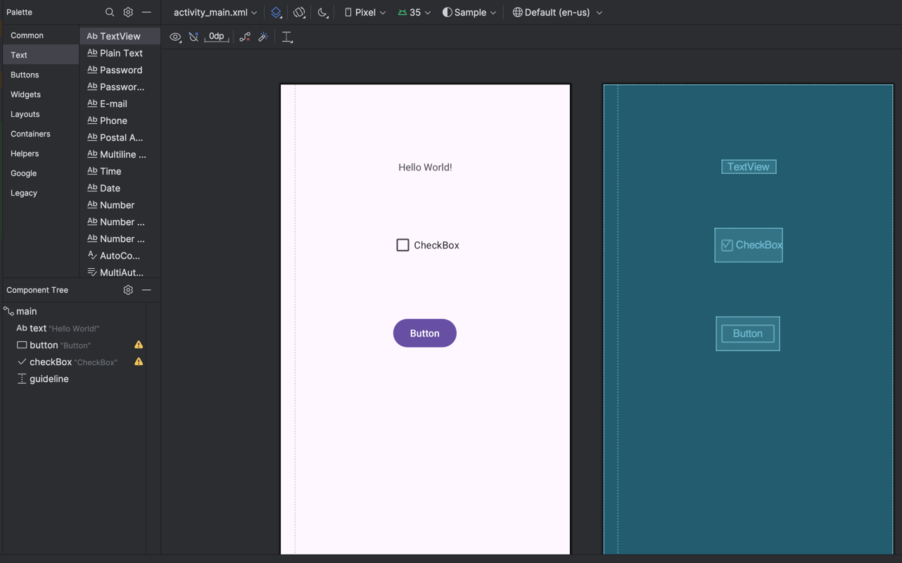

This repository contains a simple Android application and tests written in Appium Java client and Espresso.

To add elements and actions to the application, open a project in Android Studio and make changes in these files:
```
> testing/android/sample/app/src/main/res/layout
> testing/android/sample/app/src/main/java/org/example/sample/MainActivity.java
```



Espresso tests can be updated and executed in Android Studio:
```
> testing/android/sample/app/src/androidTest/java/org/example/sample/MainActivityJTest.java
```

This [document](https://docs.google.com/document/d/1bGSjQnpqy4CGfz3PrDtDo8Oij3vwHSFAV0Z9daMaV3Q/edit?usp=drive_link) explains how to configure a project to run tests in Google Firebase:


Appium tests written with Java client are located in the below link. Use IntelliJ to update and execute them. 
```
 > testing/appium/appium_android_java/src/test/java/org/example/SampleTest.java
```


